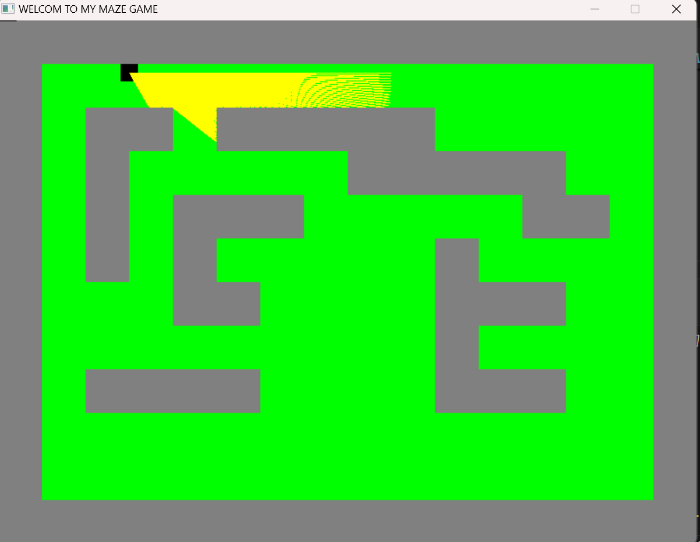
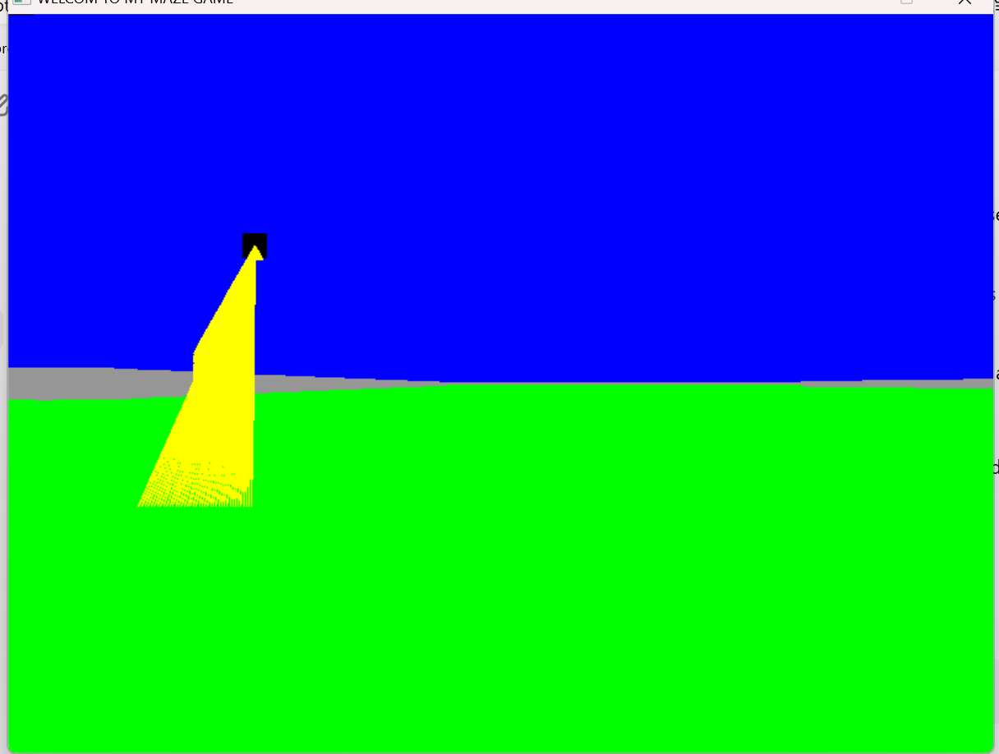

# **The Maze - A 3D Raycasting Game**

---

## **Introduction**

The Maze is a 3D game created using raycasting, where players navigate through a maze. This game is built using C, SDL2, and includes various elements such as walls, player controls, and lighting effects based on the player’s perspective.

- **Live Site**: [Link to Deployed Site](https://djamaarima7.wixsite.com/portfolio)  
- **Final Project Blog Article**: [Read the Blog](https://medium.com/@djamaarima7/the-maze-0daf140e60bb)  
- **Author(s)**:  
  - [ryma djamaa](www.linkedin.com/in/ryma-djamaa-648a4b260)

---

## **Installation**

To run this project on your local machine, follow the steps below:

1. Clone the repository:
   ```bash
   git clone https://github.com/rimadjamaa/The_Maze_Game.git
   ```

2. Navigate to the project directory:
   ```bash
   cd the-maze
   ```

3. Install the required dependencies:
   ```bash
   sudo apt-get install libsdl2-dev
   ```

4. Compile the source code:
   ```bash
   make
   ```

5. Run the game:
   ```bash
   ./maze_game
   ```

---

## **Usage**

- Use arrow keys or WASD to move the player around the maze.
- The game will display a first-person 3D perspective and light up the path based on the player's view.

---

## **Contributing**

Contributions are welcome! Please follow these steps:

1. Fork the repository.
2. Create a new branch (`git checkout -b feature/new-feature`).
3. Make your changes.
4. Commit your changes (`git commit -m 'Add new feature'`).
5. Push to the branch (`git push origin feature/new-feature`).
6. Create a pull request.

---

## **Related Projects**

If you're interested in similar projects, check out:

- [Another Maze Game](https://github.com/QuantitativeBytes/qbRayTrace.git)
- [3D Raycasting Project](https://youtu.be/PoIU11A49ZM)

---

## **Licensing**

This project is licensed under the MIT License. See the [LICENSE](LICENSE) file for details.

---

## **Screenshot**



---

## **Resources**

- [What your code repository says about you](https://changelog.com/posts/what-your-code-repository-says-about-you)
- [Here’s an awesome list of READMEs](https://github.com/matiassingers/awesome-readme)

---

## Project Story and Inspiration

Your portfolio project will not be the most technically impressive application that a recruiter or hiring manager sees. Bring context to the application by sharing your inspiration for creating this or express the technical challenge you set out to solve. 

**Inspiration**:  
The Maze project began as part of my final year in the ALX Leadership Programme, where we were tasked with pushing our technical skills to the next level. Inspired by classic 3D games like Wolfenstein 3D, I wanted to delve deep into the world of raycasting and real-time rendering, building a game from scratch using only the foundational elements of C and SDL2.

**Challenges Faced**:  
- The most significant technical challenge was creating an efficient raycasting algorithm to simulate a 3D environment in a 2D space. Understanding how to manipulate camera angles, lighting, and wall rendering within performance constraints was no easy feat!
- Optimizing the game to run smoothly on limited hardware also pushed me to refine my code for maximum performance.

**What’s Next?**  
I envision several future iterations of this project. The next steps could involve adding more complex player interactions, developing a more visually dynamic environment, and enhancing the map's diversity. Furthermore, I plan to integrate audio features and a multiplayer mode to elevate the immersive experience.

---

This project was a great learning experience that challenged both my technical abilities and problem-solving skills. While it was tough at times, it taught me the value of perseverance and collaboration in bringing a vision to life.

---

## Technical Deep Dive

In this section, I want to give a deeper look into some of the technical decisions I made, specifically around raycasting and performance optimization:

1. **Raycasting Algorithm**  
   The core of the game revolves around casting rays from the player's point of view to detect walls and objects in the environment. The rays extend out from the player's position at different angles, calculating the distance to the nearest wall and rendering the appropriate perspective. Each ray determines the height and position of the walls, creating the illusion of a 3D environment.

2. **Performance Optimizations**  
   Given the constraints of working with SDL2, I focused on minimizing frame drops by fine-tuning the rendering process. I limited the number of rays cast in each frame and optimized the mathematical operations to ensure that the game would run smoothly, even on older machines.

---

## Screenshots and Visuals


*Rendering walls in the maze using the raycasting technique*


*Player navigating through the maze*

---

## Final Thoughts

This project helped me grow as a software engineer, and I'm excited to keep iterating on this concept in the future. Bringing technical depth to a creative project is one of the most rewarding aspects of software development, and I hope you can see the passion and hard work behind the keyboard.

---

## Examples of great README.md’s that inspire me:

- [DeepFakes](https://github.com/deepfakes/faceswap)
- [WikiGraph](https://github.com/jongracecox/wikigraph)
- [Job Odyssey](https://github.com/jobodyssey/jobodyssey)

---

Thank you for checking out **The Maze**! Feel free to explore the code and provide feedback!

